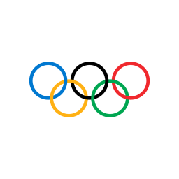
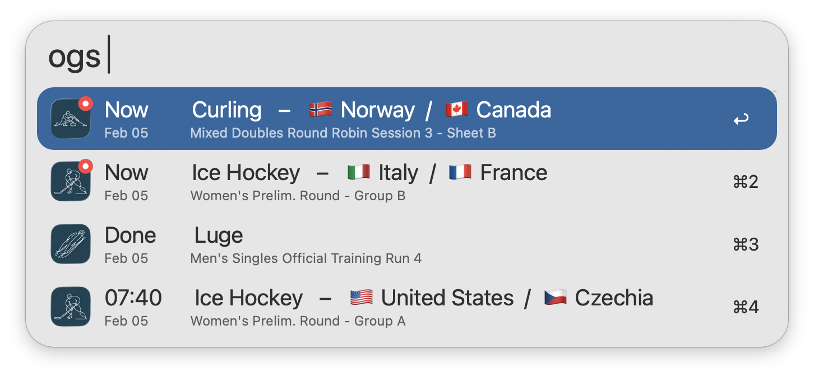
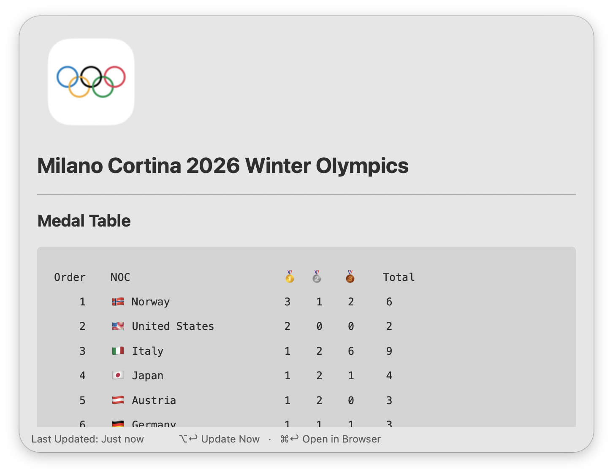
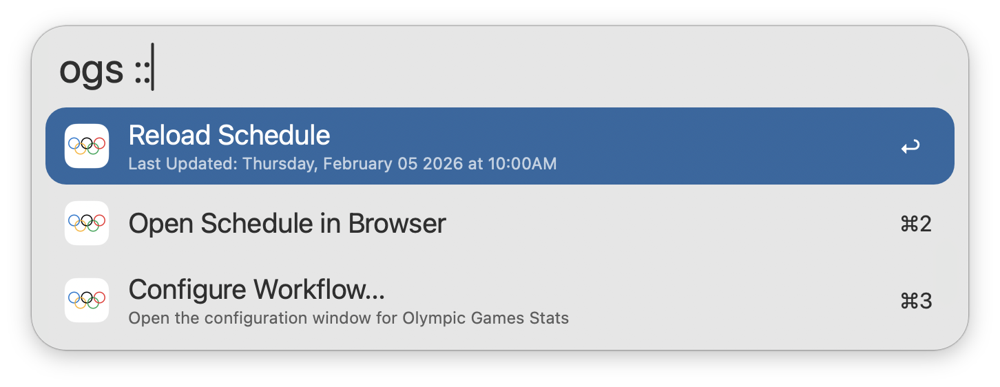

#  Olympic Games Stats

View the current Olympic standings & stats in Alfred

[⤓ Install from the Alfred Gallery](https://alfred.app/workflows/firefingers21/olympic-games-stats/)

## Setup

This workflow requires [jq](https://jqlang.github.io/jq/) to function, which comes preinstalled on macOS 15 Sequoia and later.

## Usage

View the current [Olympic Games](https://www.olympics.com/) schedule via the `ogs` keyword, adjusted to your local time zone. Type to filter by Sport, Country, Event, Medal Event, or Date.

* <kbd>↩</kbd> Open event details in browser.
* <kbd>⌥</kbd><kbd>↩</kbd> Show/Hide old events.

Use the `ogm` keyword to view Olympic Medal Tables.

* <kbd>⌘</kbd><kbd>↩</kbd> Open in Browser.
* <kbd>⌥</kbd><kbd>↩</kbd> Refresh Medal Table.

Append `::` to the configured [Keyword](https://www.alfredapp.com/help/workflows/inputs/keyword) to access other actions, such as manually reloading the schedule cache.

Configure the [Hotkey](https://www.alfredapp.com/help/workflows/triggers/hotkey/) as a shortcut for viewing schedules.